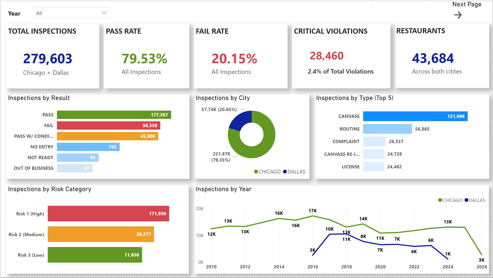
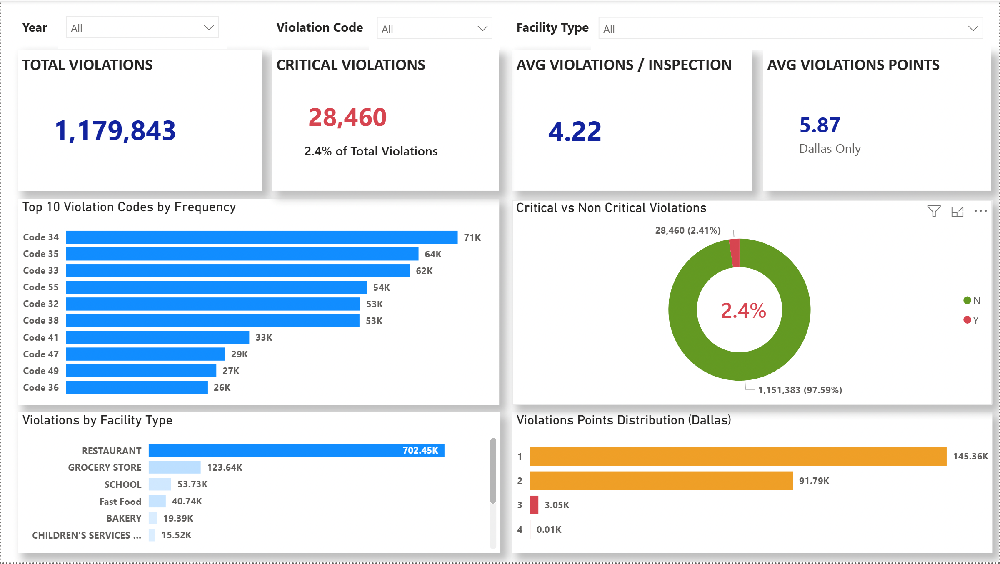
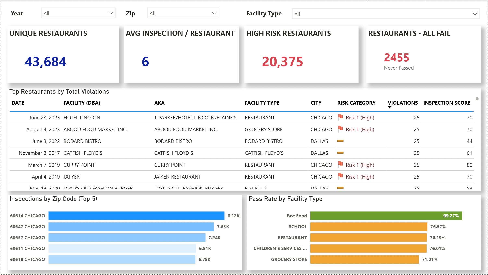
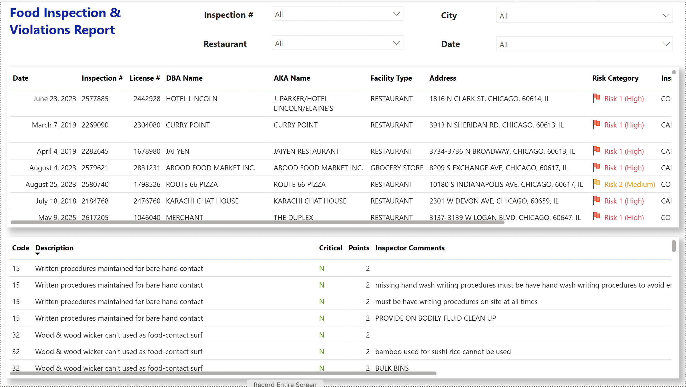
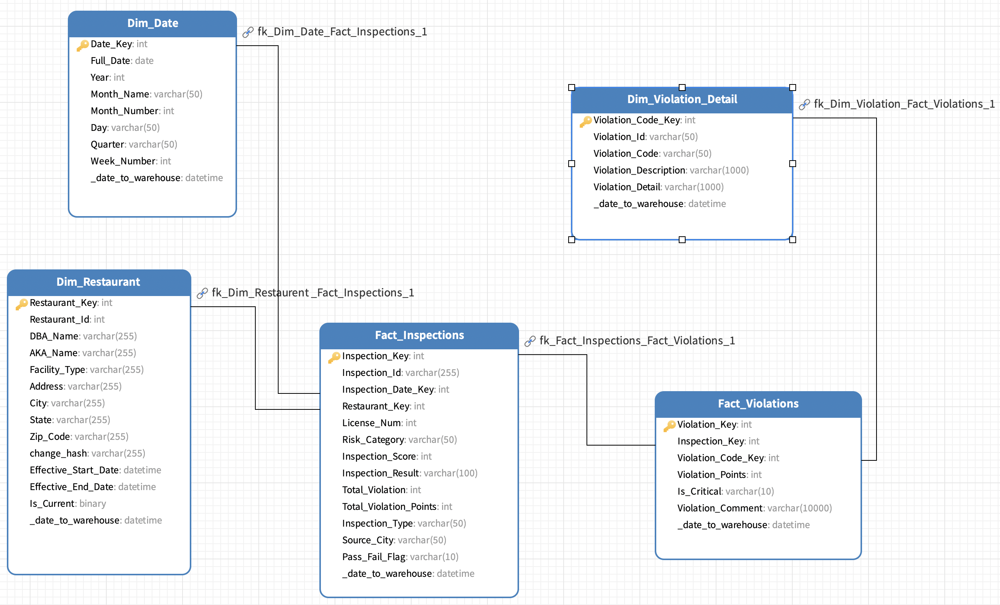

# Food Inspections Data Pipeline
An end-to-end data engineering pipeline built using Medallion Architecture on Databricks. This project ingests food inspection data from Chicago and Dallas public APIs, transforms it through Bronze, Silver, and Gold layers, and models it into a dimensional warehouse for analytics and reporting.
---
## Overview
This project demonstrates a production-style data pipeline that handles real-world challenges such as schema mismatches, data quality issues, and multi-source integration.
The pipeline processes food inspection datasets from two cities with completely different structures and transforms them into a unified, analytics-ready model.
### Key Objectives
- Build a scalable Medallion Architecture pipeline (Bronze, Silver, Gold)
- Design a metadata-driven ingestion framework
- Handle schema inconsistencies across multiple data sources
- Implement Slowly Changing Dimension Type 2 for historical tracking
- Enforce strong data quality validation and filtering
- Deliver a dimensional model optimized for analytics
---
## Architecture

Chicago API + Dallas API
↓
Raw Landing / Staging
↓
Bronze Layer (Raw Delta Tables)
↓
Silver Layer (Cleansed and Standardized)
↓
Gold Layer (Star Schema Warehouse)
↓
Power BI / Analytics

### Layer Description
| Layer | Description |
|------|------------|
| Bronze | Raw ingestion from APIs with minimal transformation and metadata columns |
| Silver | Data cleansing, schema standardization, deduplication, and validation |
| Gold | Dimensional model with fact and dimension tables for analytics |
---
## Data Sources
| City | Source | Records |
|------|-------|--------|
| Chicago | Chicago Open Data API | 308,343 |
| Dallas | Dallas Open Data API | 78,984 |
### Total Data Processed
- 387,000+ records processed
- Two heterogeneous datasets unified into one schema
---
## Key Engineering Challenges
### 1. Schema Mismatch
Chicago and Dallas datasets had completely different formats:
- Chicago stored violations in a single text column
- Dallas stored violations across 25 separate columns
### 2. Data Transformation
- Parsed Chicago violation text using regex
- Converted Dallas wide format into normalized row-level structure
- Unified both datasets into one consistent schema
### 3. Identifier Generation
Generated surrogate keys using MD5 hashing:
- `inspection_id`
- `restaurant_id`
- `violation_id`
### 4. Derived Attributes
- Facility type derived using keyword logic
- Risk category standardized across datasets
- Latitude and longitude extracted from strings
---
## Data Quality and Validation
A custom validation framework was implemented to ensure clean and reliable data.
### Rules Applied
- Mandatory fields cannot be null
- ZIP codes must be valid 5-digit values
- Violation scores must be within valid range
- Duplicate records removed
- Business rules enforced for inspection validity
### Results
- 1,300 invalid records detected and removed
- Clean, validated dataset produced in Silver layer
- Zero invalid records propagated to Gold layer
---
## Dimensional Model
The Gold layer follows a star schema design.
### Dimension Tables
- `dim_date`  
  Stores calendar attributes for analysis
- `dim_restaurant`  
  Implements SCD Type 2 to track historical changes
- `dim_violation_detail`  
  Stores unique violation definitions
### Fact Tables
- `fact_inspections`  
  One row per inspection
- `fact_violations`  
  One row per violation per inspection
### Key Features
- SCD Type 2 implementation using effective dates and current flags
- MD5-based surrogate keys
- Separate fact tables for different analytical granularity
---
## Business Use Cases
- Identify high-risk restaurants based on violations
- Track inspection trends over time
- Compare food safety patterns across cities
- Analyze most common violations
- Monitor historical changes in restaurant data
---
## Dashboards

These dashboards are built on the Gold layer star schema to demonstrate real-world analytics use cases.

### Overview Dashboard


### Violation Analysis


### Trend Analysis


### City Comparison


---
## Dimensional Model


---
## Tech Stack
- Databricks
- PySpark
- Delta Lake
- Unity Catalog
- Power BI
### Concepts Used
- Medallion Architecture
- ETL Pipeline Design
- Data Modeling (Star Schema)
- Slowly Changing Dimensions (Type 2)
- Data Quality Validation
- Surrogate Key Design
---
## Setup and Execution
### Prerequisites
- Databricks workspace
- Unity Catalog enabled
- Cluster with internet access
### Step 1: Configure Environment
Update constants in `utils.py`:
```python
CATALOG       = "Final_Project"
BRONZE_SCHEMA = "Bronze_Zone"
SILVER_SCHEMA = "Silver_Zone"
GOLD_SCHEMA   = "Gold_Zone"
META_SCHEMA   = "pipeline_metadata"
```

### Step 2: Initialize Environment
```
Run:

01_Environment_Setup.ipynb
```

### Step 3: Load Metadata
```
INSERT INTO Final_Project.pipeline_metadata.parent_metadata VALUES
('Dallas', 'Dallas_Restaurant_and_Food_Establishment_Inspections.csv', 'Y', current_date(), current_date()),
('Chicago', 'Chicago_Restaurant_and_Food_Establishment_Inspections.csv', 'Y', current_date(), current_date());
```

### Step 4: Run Pipeline
```
Execute notebooks in order:

02_Raw_to_Bronze_Load.ipynb
03_Bronze_to_Silver_Load.ipynb
04_Silver_to_Gold_Load.ipynb
```

### Step 5: Monitor Pipeline
```
SELECT * 
FROM Final_Project.pipeline_metadata.child_metadata
ORDER BY execution_time DESC;
```

```
Project Structure

├── notebooks/
│   ├── 01_Environment_Setup.ipynb
│   ├── 02_Raw_to_Bronze_Load.ipynb
│   ├── 03_Bronze_to_Silver_Load.ipynb
│   └── 04_Silver_to_Gold_Load.ipynb
├── Source_Data_Analysis.ipynb
├── Util.ipynb
├── Food_Inspections_Project_Report.pdf
├── Source_to_Target_Mapping_Final_Project.xlsx
├── Food_Inspection(Final_project).nmodel
└── README.md
```
```
Best Practices Implemented

* Metadata-driven pipeline design
* Idempotent data loading using Delta MERGE
* Data quality validation at transformation stage
* Separation of raw, processed, and analytics layers
* Use of surrogate keys for consistency
* Quarantine handling for invalid data
* Audit columns for lineage tracking
```

Note on Visualization

Power BI (.pbix) file is not included due to GitHub file size limitations. Dashboard screenshots can be added for reference.

Repository Purpose

This repository showcases a complete data engineering workflow from ingestion to analytics. It demonstrates practical experience in building scalable pipelines, handling real-world data issues, and designing data models for business intelligence.
